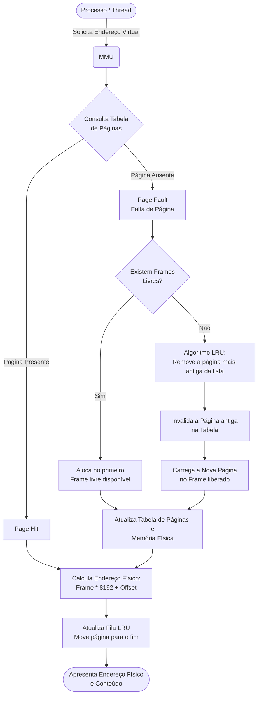

# Link da apresentação: https://youtu.be/e_oijN3F_UY
# Simulador de Gerenciamento de Memória Virtual (MMU)
Este repositório contém a implementação do Segundo Trabalho Prático da disciplina de Sistemas Operacionais: Análise e Aplicações da Universidade do Vale do Rio dos Sinos (UNISINOS).
O objetivo do projeto é simular o funcionamento de uma Unidade de Gerenciamento de Memória (MMU), traduzindo endereços virtuais para físicos, gerenciando Page Faults e aplicando políticas de substituição de páginas.
# Especificações do Sistema Simulado
O sistema foi modelado em Python seguindo os requisitos estabelecidos no enunciado, supondo um sistema com as seguintes características:
- Memória Principal (RAM): 64 KB (dividida em 8 frames)
- Memória Virtual: 1 MB (dividida em 128 páginas)
- Tamanho da Página e Frame: 8 KB (8192 bytes)
- Algoritmo de Substituição: LRU (Least Recently Used - Menos Recentemente Utilizada).
# Como Executar
Certifique-se de ter o Python 3.x instalado em sua máquina. Para rodar o simulador, execute o seguinte comando no terminal:
```bash
python simulador.py
```
## Fluxo de Execução




# Python-MMU-Simulator
Simulador de MMU em Python para a disciplina de Sistemas Operacionais: Análise e Aplicações
